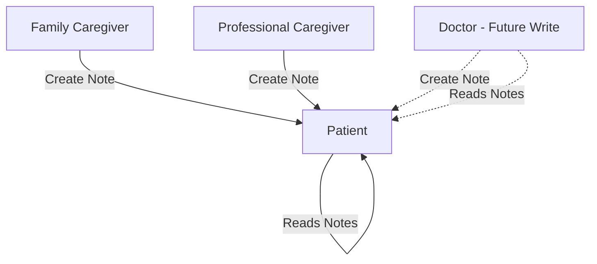

# MediMind: Application Information Architecture & Navigation Design

**Intelligent Medication Management Platform**  
*Target:* All 6 user roles with a healthcare-grade information architecture.

This document defines the Minimum Viable Product (MVP) scope, user roles, daily workflows, and the navigation architecture for the MediMind platform.

---

## 1. Executive Summary
The application flow is designed around **user goals and daily workflows**. Key architectural highlights include:
- **6 User Roles:** Patient, Family Caregiver (free), Professional Caregiver (paid), Doctor, Pharmacist, Admin
- **Mobile-First PWA:** Bottom tab navigation, minimal navigation depth, offline support.
- **Privacy by Design:** Role-based data access enforced at the model layer; relationships require mutual acceptance.
- **Real Business Workflows:** Refill orders → Payments, Caregiver invitations, Doctor/Pharmacist collaboration.
- **Bilingual Support:** Full LTR/RTL (English/Arabic) architecture.

---

## 2. MVP Scope

The first release focuses exclusively on the core workflows for Patients, Caregivers, and Admins.

### ✅ Included (MVP)
- Authentication (Login, Register, Forgot Password, OTP)
- Medication Management
- Adherence Tracking
- Patient Profile & Addresses
- Health Records
- Family Caregiver Portal
- Professional Caregiver Portal
- Shared Notes System
- Admin User Management
- Notifications Center
- OCR Prescription Scanning

### ❌ Excluded (Future Releases)
- Messaging / Chat
- Billing & Payments
- Pharmacy Integration
- Appointment Scheduling
- AI Features
- Reports & Analytics
- Wearable Integrations
- Doctor Portal (Full)

---

## 3. User Roles, Goals & Primary Workflows

### 3.1 Patient (Main App User)
**Core Goal:** Adhere to medications, manage health, stay organized.
* **Daily Adherence:** Check medication reminders, confirm doses taken.
* **Inventory Management:** View remaining quantities, refill low medications.
* **Caregiver Collaboration:** Invite family/professional caregivers to support.
* **Health Records:** View medical conditions, emergency contacts, doctor notes.
* **Refill Orders:** Order medications from pharmacist, track fulfillment.
* **Communication:** Read doctor/pharmacist notes, ask questions.

### 3.2 Family Caregiver (Free Support Role)
**Core Goal:** Monitor and support patient medication adherence, step in when needed.
* **Patient Monitoring:** View patient's medication schedule, adherence status.
* **Escalation Response:** Receive alerts if patient misses doses; help confirm.
* **Medication Management:** Add/edit medications for linked patient.
* **Relationship Management:** Accept patient invitations, manage multiple patients.
* **Health Records:** Access patient's medical conditions (if consent granted).
> **Note:** Cannot access patient data until the patient explicitly invites and caregiver accepts.

### 3.3 Professional Caregiver (Paid Premium Support)
**Core Goal:** Provide paid caregiving services, manage patient roster, track billing.
* **Patient Roster:** View assigned patients and their medication schedules.
* **Dose Management:** Confirm doses on behalf of patients, note adherence issues.
* **Communication:** Message patients, doctors, pharmacists.
* **Relationship Negotiation:** Accept/reject patient job offers.
* **Payment Tracking:** View payments received, history, invoices.

### 3.4 Doctor (Content & Care Coordinator)
**Core Goal:** Publish health education, communicate with patients, manage medical guidance.
* **Patient Relationships:** Accept patient relationship requests; manage multiple patient cases.
* **Notes & Guidance:** Write patient-specific medical notes (privacy-isolated).
* **Content Publishing:** Publish disease-specific advice and educational blogs.
* **Patient Records:** View patient's medication regimen and adherence (if consent granted).
* **Collaboration:** Communicate with pharmacists regarding patient medication adjustments.

### 3.5 Pharmacist (Fulfillment & Support)
**Core Goal:** Fulfill refill orders, communicate with patients and doctors, publish pharmacy content.
* **Refill Order Fulfillment:** View pending refill orders, mark as preparing/dispensed, manage inventory.
* **Patient Relationships:** Accept patient relationship requests.
* **Order Communication:** Message patients regarding order status, availability, pricing.
* **Collaboration:** View doctor notes related to patient medications.
* **Content Publishing:** Publish pharmacy-related disease advice and medication safety blogs.

### 3.6 Admin (Platform Governance)
**Core Goal:** Manage users, ensure compliance, oversee content, maintain platform integrity.
* **User Management:** Create/suspend accounts (esp. professional accounts).
* **Content Oversight:** Review and publish health content.
* **Audit & Compliance:** View consent logs, payment ledgers, system health.
* **Platform Analytics:** Monitor adoption, adherence rates, payment metrics.
* **System Health:** Access error logs, deployment status, infrastructure monitoring.

---

## 4. MVP Navigation Structures

Based on the MVP scope, users are redirected to the appropriate portal after authentication.

### Patient Portal
* **Home:** Daily medication overview, upcoming doses, adherence summary, recent activity.
* **Medications:** Medication Cabinet, Details, Add/Edit Medication, Inventory, Refill (Reference only).
* **Adherence:** Daily Timeline, Medication History, Activity Log.
* **Caregivers:** Manage Caregivers.
* **Profile:** Personal Information, Addresses, Health Records, Settings (Lang, Theme, etc.).

### Family Caregiver Portal
* **Home:** General dashboard.
* **Patients:** Linked patients.
* **Notifications:** Alert tracking.
* **Profile:** Account management.
* **Patient Workspace (Drilldown):** Overview, Medications (Read Only/Edit based on permissions), Adherence, Health Records, Notes.

### Admin Portal
* **Dashboard:** System metrics.
* **Users:** Manage users.
* **Settings:** Platform settings.
* **Profile:** Admin profile.

---

## 5. Shared Notes System (MVP)

The Notes feature enables essential communication regarding a patient's care.

### Permissions Matrix
- **Family / Professional Caregivers:** Create and view notes for assigned patients.
- **Patient:** View all notes addressed to them. Cannot edit or delete caregiver notes.
- **Doctor (Future):** Can view patient notes and create notes for specific patients.

### Note Creation Flow



---

## 6. Route Hierarchy (MVP Focus)

Protected routes are handled using Next.js route groups `(group-name)` and require authentication along with role-based middleware.

```text
frontend/src/app
├── (public)                                       # Unauthenticated Users
│   ├── login/page.jsx
│   ├── register/page.jsx
│   ├── forgot-password/page.jsx
│   └── otp/page.jsx
│
├── (patient)                                      # Patient Portal
│   ├── home/page.jsx
│   ├── medications/
│   │   ├── page.jsx                               # Medication Cabinet
│   │   ├── add/page.jsx                           # Add Medication Form
│   │   └── [id]/page.jsx                          # Medication Details & Edit
│   ├── adherence/page.jsx                         # Daily Timeline & History
│   ├── caregivers/
│   │   ├── page.jsx                               # Manage Caregivers
│   │   ├── add/page.jsx                           # Invite Caregiver
│   │   └── [id]/page.jsx
│   ├── health-records/page.jsx                    # Medical Profile
│   ├── notes/page.jsx                             # Shared Notes
│   ├── ocr-scan/page.jsx                          # Prescription Scanning
│   ├── profile/page.jsx                           # Personal Info & Settings
│   └── notifications/page.jsx                     # Notifications Center
│
├── (caregiver)                                    # Caregiver Portal
│   ├── home/page.jsx                              # General Dashboard
│   ├── patients/
│   │   ├── page.jsx                               # Linked Patients List
│   │   └── [id]/                                  # Patient Workspace
│   │       ├── overview/page.jsx
│   │       ├── medications/page.jsx
│   │       ├── adherence/page.jsx
│   │       ├── health-records/page.jsx
│   │       └── notes/page.jsx
│   ├── profile/page.jsx                           # Account Management
│   └── notifications/page.jsx                     # Alert Tracking
│
├── (admin)                                        # Admin Portal
│   ├── dashboard/page.jsx                         # System Metrics
│   ├── users/page.jsx                             # Manage Users
│   ├── settings/page.jsx                          # Platform Settings
│   └── profile/page.jsx                           # Admin Profile
│
├── layout.jsx                                     # Root Layout & Providers
├── page.jsx                                       # Root Page (Auth-based Redirect)
└── not-found.jsx                                  # 404 Error Page
```
