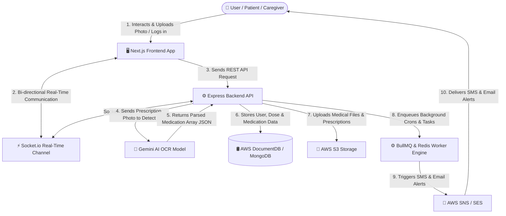

# MediMind - System Overview Flow Diagram

> **Description**: Functional system flow diagram illustrating step-by-step data movement and interactions between User, Frontend, Express Backend API, Gemini AI OCR Model, Database, File Storage, BullMQ Worker, and Socket.io real-time connection.

---

## 📊 System Overview Flowchart

---

## 🔁 Step-by-Step Flow Explanation

1. **User Action**: The user (Patient, Caregiver, Doctor, or Pharmacy) interacts with the **Next.js Frontend** (e.g., logging in, scanning a prescription, snooze/confirming doses).
2. **Socket.io Bi-directional Channel**: **Socket.io** operates directly between **Express Backend API** and **Next.js Frontend App** for real-time notification pushes, live adherence updates, and instant alert sync.
3. **API Request**: The Frontend sends HTTP REST requests to the **Express Backend API**.
4. **AI Prescription OCR**: When a prescription photo is uploaded, the Backend sends the image to **Gemini AI**, which parses the text and returns a structured array of medication names, dosages, and schedules.
5. **Database Storage**: The Backend stores structured patient data, medication records, adherence logs, and relationships into **AWS DocumentDB (MongoDB)**.
6. **File Storage**: Uploaded raw files and prescription images are stored directly in **AWS S3 Storage**.
7. **Worker Processing**: Heavy background tasks (daily schedule populating, missed dose checks, max snooze timers) are enqueued to the **BullMQ & Redis Worker Engine**.
8. **SMS & Email Notifications**: Automated external notifications are dispatched via **AWS SNS & SES** (SMS and Email) to patients and caregivers.
